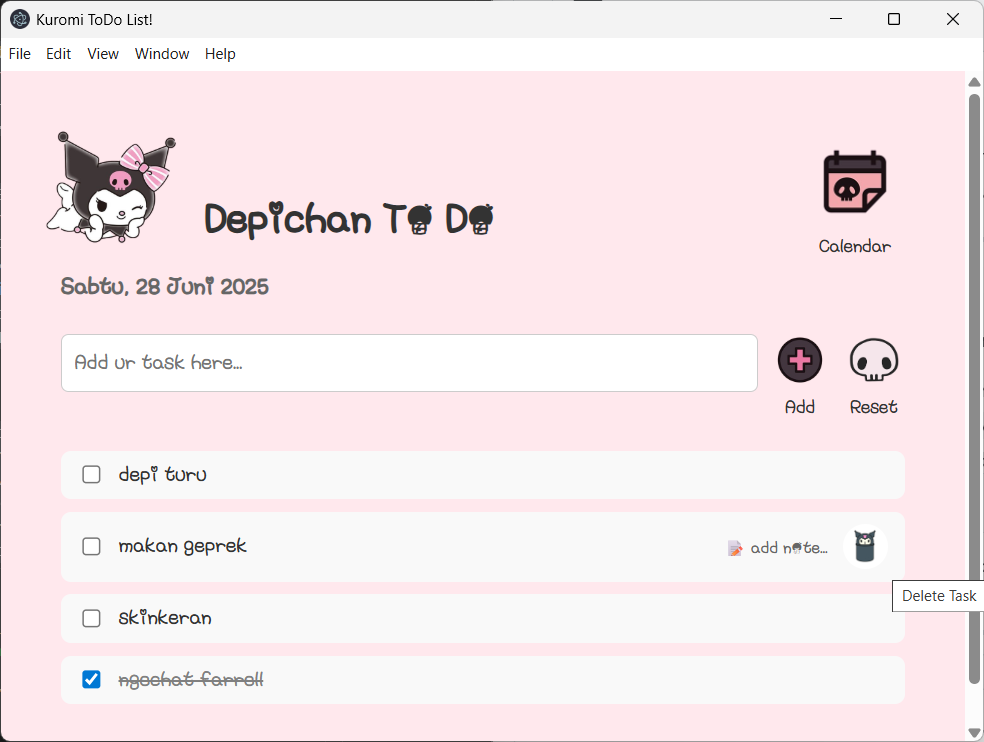

# Kuromi ToDo List

A simple, cute, and interactive To Do List application built with [Electron](https://electronjs.org). Easily manage your daily tasks with support for notes, calendar view, and a fun Kuromi theme!

---

## Fitur Utama

- **Tambah, edit, dan hapus tugas** dengan mudah
- **Checklist** tugas yang sudah selesai
- **Catatan** untuk setiap tugas (klik 📝 untuk menambah/mengedit note)
- **Reset** semua tugas dengan satu klik
- **Tampilan kalender** untuk melihat/memilih tugas per tanggal
- **Fokus otomatis** ke input setelah menambah tugas
- **Penyimpanan lokal** (persisten, berbasis file JSON)
- **Antarmuka lucu** dengan ikon Kuromi dan tombol custom

---

## Tampilan




---

## Instalasi & Menjalankan

### 1. Clone Repository

```bash
git clone https://github.com/depichan18/to-do-list.git
cd to-do-list
```

### 2. Install Dependencies

```bash
npm install
```

### 3. Jalankan Aplikasi

```bash
npm start
```

> **Catatan:** Pastikan Anda sudah menginstall [Node.js](https://nodejs.org/) dan [npm](https://www.npmjs.com/).

---

## Coba Langsung (Windows .exe)

Jika ingin langsung mencoba tanpa instalasi, silakan download file **KuromiToDo.exe** di [rilis terbaru di GitHub Releases](https://github.com/depichan18/to-do-list/releases/tag/depichan18) jika tersedia.

- **Langkah:**
  1. Download file `KuromiToDo.exe`
  2. Jalankan file tersebut (double-click)
  3. Aplikasi siap digunakan tanpa perlu instalasi Node.js/npm

> **Catatan:** File .exe hanya tersedia untuk Windows.  
> Jika Windows menampilkan peringatan "Windows protected your PC", klik **More info** lalu klik **Run anyway**.

---

## Cara Pakai

1. **Tambah Tugas:**  
   Ketik tugas di input "Add ur task here..." lalu tekan <kbd>Enter</kbd> atau klik tombol **Add**.

2. **Edit Tugas:**  
   Klik teks tugas untuk mengedit, lalu tekan <kbd>Enter</kbd>.

3. **Checklist:**  
   Klik kotak centang untuk menandai tugas selesai/belum.

4. **Catatan Tugas:**  
   Klik tulisan 📝 add note... pada tugas untuk menambah/mengedit catatan.

5. **Hapus Tugas:**  
   Klik ikon Trash pada tugas.

6. **Reset:**  
   Klik tombol **Reset** untuk menghapus semua tugas.

7. **Kalender:**  
   Klik ikon kalender untuk melihat/memilih tugas per tanggal.

---

## Kustomisasi Ikon

Semua ikon/gambar berada di folder `utilities/`.  
Kamu bisa menggantinya sesuai selera!

---

## Pengembangan & Kontribusi

- Fork repo ini
- Buat branch fitur (misal: `fitur-notifikasi`)
- Lakukan perubahan & commit
- Ajukan Pull Request

---

## Lisensi

Aplikasi ini open-source.  
Lisensi bebas digunakan dan dikembangkan untuk keperluan pribadi atau belajar.

---

##  Credits

- [Electron](https://electronjs.org/)
- Kuromi & Sanrio artwork digunakan untuk tujuan personal/non-komersial
- Ikon dari [icons8.com](https://icons8.com/) & [flaticon.com](https://www.flaticon.com/)

---

**Happy organizing!**
